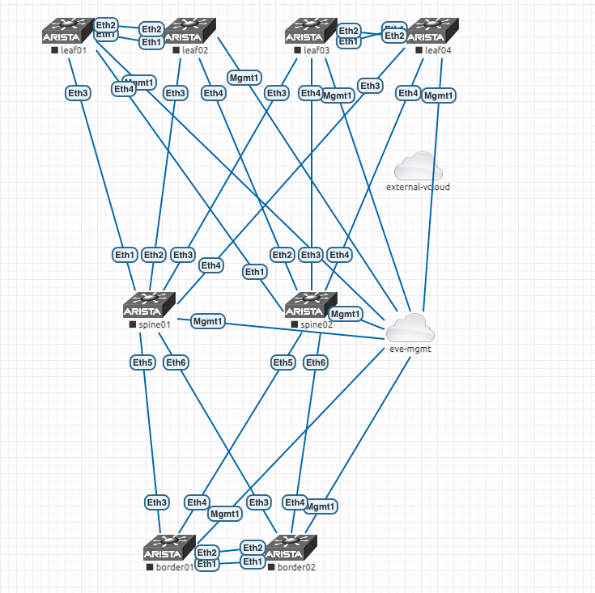

# eveng-arista-topology

This repository provides a topology file to build an Arista L3LS+EVPN fabric in [EVE-NG](https://www.eve-ng.net/). The fabric topology is meant to help with exploring and practicing concepts in Arista's [EVPN Deployment Guide](https://www.arista.com/custom_data/downloads/?f=/support/download/DesignGuides/EVPN_Deployment_Guide.pdf).




## Requirements

To deploy the topology, you will need to have the following:

* a running instance of EVE-NG
* The [evensdk](https://github.com/ttafsir/evengsdk) library and CLI tool.

> **Note:** The topology uses `veos-4.27.0F` for the node image. Make sure that you either have the image available by downloading from the Arista portal, or replace it with a veos image that you already have in EVE-NG.

## Install Requirements

To install the `evengsdk` library and CLI tool, run the following command:

```sh
pip install eve-ng
```

## Configure Your Environment

You can define your environment variables in a `.env` so that you can easily export environemnt variables to configure the EVE-NG CLI tool. **This will prevent you from getting prompted for credentials**.

STEP 1. Create your `.env` file

```txt
export EVE_NG_HOST=192.168.2.100
export EVE_NG_USERNAME=admin
export EVE_NG_PASSWORD=eve
```

:warning: The `.env` file is ignored from version control so that you do not accidentally

STEP 2. Source the variables from the file

```sh
source .env
```

## Create lab from topology

Create the lab

```
eve-ng lab create-from-topology -t topology.base.yml
```

Verify that lab is showing in list

```sh
eve-ng lab list
```

View the nodes in your lab

```
eve-ng node list --path /arista-level3-lab.unl
```

> Note: To avoid repeatedly having to provide the lab path, you can export `EVE_NG_LAB_PATH=/arista-level3-lab.unl` or add it to your `.env` file and source it.

Start your lab

```sh
eve-ng lab start --path /arista-level3-lab.unl
```
